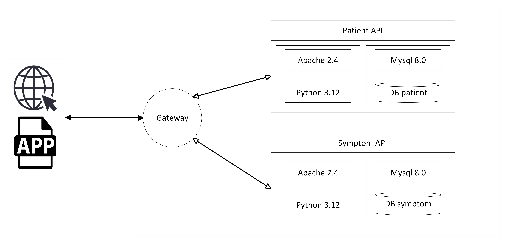

# TFG IAramburu Symptom API

Service implemented in  apache 2 + php8.2 to be used as part of a learning process of a CI/CD flow.


Here is the general architecture of the application. This repository only contains the API Gateway module.



### Requirements

The requirements to deploy:
- Docker
- Docker-compose
- Make

# APACHE


### Exposed Ports
|  Services  |  Exposed  |  Docker  |
|:----------:|:---------:|:--------:|
|   HTTP     |   9880    |    80    |
|   HTTPS    |   9440    |    443   |


## Certificates
To generate SSL certificates for the development environment, [minica](https://bitbucket.org/iaramburu-tfg/devopsutility/src/main/) has been utilized.

A wildcard certificate has been employed in the certificate generation to encompass all domains under 'tfg.test,' thereby simplifying certificate management. It is important to note that when using certificates in containers, container names must end with 'tfg.test' to ensure proper certificate functionality.


# Getting Started


To initiate the API, execute the following command:

```bash
make start
```

For further guidance on what `make` can accomplish, just input the following command:

```bash
make help
```

## Endpoints

It only accepts requests with the "Accept application/json" header, otherwise it returns a 302 to / as the default behaviour in Laravel.

* GET /api/v1/patient : get all patients, in json format.
* GET /api/v1/patient/summary/{patient_id} : get a summary of patient data and patient symptoms.

# para hacer el secret
kubectl create secret tls gateway-cert-name     --cert=devops/apache/certs/cert-pro.pem     --key=devops/apache/certs/key-pro.pem

