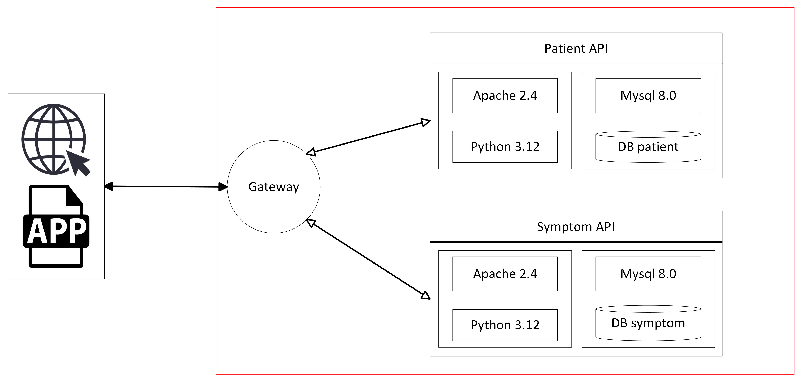

# TFG IAramburu Patient API

Service implemented in Python 3.12 + Django 4.2 to be used as part of a learning process of a CI/CD flow.


Here is the general architecture of the application. This repository only contains the Patient API module.



### Requirements

The requirements to deploy:
- Docker
- Docker-compose
- Make

# APACHE


### Exposed Ports
|  Services  |  Exposed  |  Docker  |
|:----------:|:---------:|:--------:|
|   HTTP     |   9080    |    80    |
|   HTTPS    |   9040    |    443   |


# Mysql

### Exposed Ports
|  Services  |  Exposed  |  Docker  |
|:----------:|:---------:|:--------:|
|   Mysql    |   3306    |   3306   |


### Environment Variables
This is the default value of the environment variables:

   - MYSQL_ROOT_PASSWORD Maite123
   - MYSQL_DATABASE listpacients
   - MYSQL_USER listpacients
   - MYSQL_PASSWORD contrasena_listpacients
   - DATABASE_HOST 127.0.0.1
   - DATABASE_PORT 3306

## Certificates
To generate SSL certificates for the development environment, [minica](https://bitbucket.org/iaramburu-tfg/devopsutility/src/main/) has been utilized.

A wildcard certificate has been employed in the certificate generation to encompass all domains under 'tfg.test,' thereby simplifying certificate management. It is important to note that when using certificates in containers, container names must end with 'tfg.test' to ensure proper certificate functionality.


### Network
- tfg_develop_infrastructure


# Getting Started


To initiate the API, execute the following command:

```bash
make start
```

For further guidance on what `make` can accomplish, just input the following command:

```bash
make help
```

---


